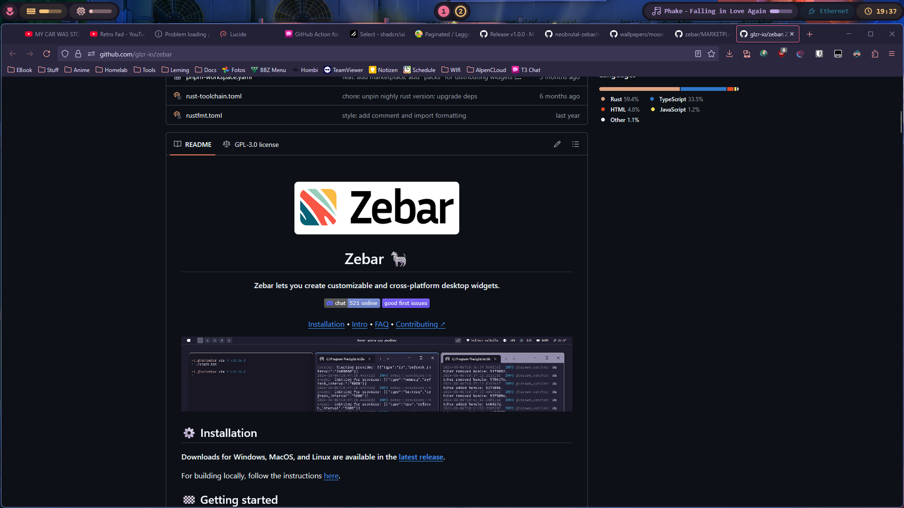
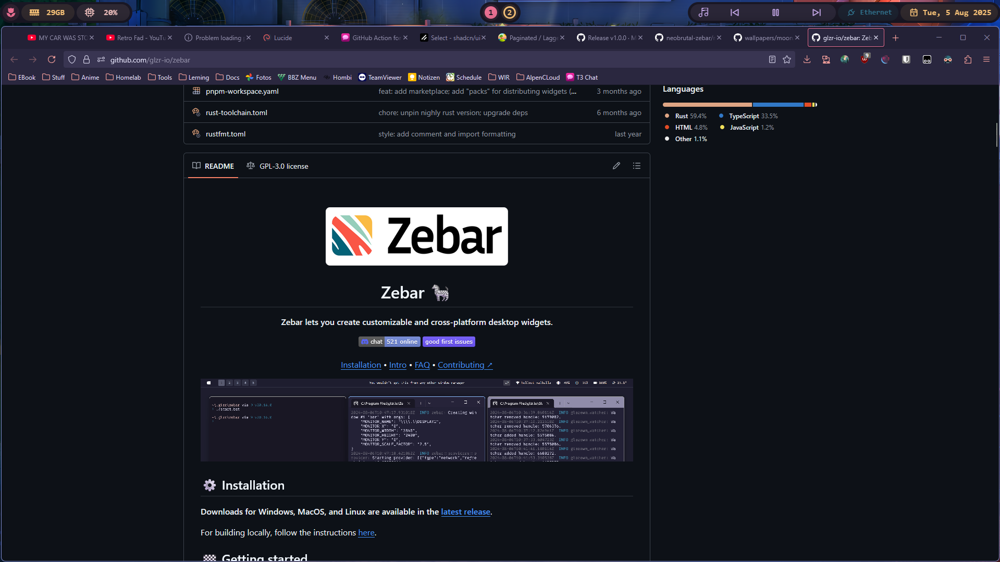

<p align="center">
    
    <h2 align="center">Zebar Rosé Pine++</h2>
</p>

<p align="center">
A fully featured topbar derived from the beautiful <a href="https://rosepinetheme.com/">Rosé Pine</a> theme, built for <a href="https://github.com/glzr-io/zebar">Zebar</a> - the modern desktop widget platform.
</p>

<p align="center">
    <a href="https://github.com/rose-pine/rose-pine-theme">
        
    </a>
</p>

## ✨ Features

- **🎨 Rosé Pine Theme**: Beautiful color palette inspired by the popular Rosé Pine theme
- **🖥️ Multi-Window Manager Support**: Compatible with GlazeWM, Komorebi, and vanilla window managers
- **📊 System Monitoring**: Real-time CPU, memory, battery, and network statistics
- **🎵 Media Controls**: Integrated media player controls with playback information
- **🕐 Smart Clock**: Elegant date and time display
- **⚡ Performance Optimized**: Built with SolidJS for blazing fast performance
- **🎯 Responsive Design**: Adapts seamlessly to different screen sizes and resolutions

## 🖼️ Preview

<div align="center">
  
  
</div>

## 🚀 Quick Start

### Prerequisites

- [Zebar](https://github.com/glzr-io/zebar) v3.0.0 or higher
- Node.js 21+ and npm/pnpm/yarn
- A supported window manager (GlazeWM, Komorebi, or None/Vanilla)

### Installation

## 🛠️ Development

1. **Clone the repository**

```bash
git clone https://github.com/m4rshe1/zebar-rose-pine-pp.git
cd zebar-rose-pine-pp
```

2. **Install dependencies**

```bash
npm install
# or
pnpm install
# or
yarn install
```

3. **Build the project**

```bash
npm run build
```

4. **Install in Zebar**
   - Copy the `zpack.json` file to your Zebar packs directory
   - Or use the development copy script: `npm run devcopy`

### Available Scripts

| Command                  | Description                       |
| ------------------------ | --------------------------------- |
| `npm run dev:glazewm`    | Build and watch for GlazeWM mode  |
| `npm run dev:komorebi`   | Build and watch for Komorebi mode |
| `npm run dev:vanilla`    | Build and watch for vanilla mode  |
| `npm run build:glazewm`  | Build for GlazeWM                 |
| `npm run build:komorebi` | Build for Komorebi                |
| `npm run build:vanilla`  | Build for vanilla                 |
| `npm run build`          | Build all variants                |

### Project Structure

```
zebar-rose-pine-pp/
├── dist/
│   ├── glazewm/                    # dist folder for GlazeWM
│   ├── komorebi/                   # dist folder for Komorebi
│   └── vanilla/                    # dist folder for Vanilla
├── src/
│   ├── components/
│   │   └── bar/
│   │       ├── background.tsx      # Background component
│   │       ├── battery.tsx         # Battery status
│   │       ├── cpu.tsx             # CPU usage
│   │       ├── datetime.tsx        # Date and time
│   │       ├── direction.tsx       # Direction indicators
│   │       ├── glazewm.tsx         # GlazeWM specific
│   │       ├── komorebi.tsx        # Komorebi specific
│   │       ├── media.tsx           # Media controls
│   │       ├── memory.tsx          # Memory usage
│   │       └── network.tsx         # Network status
│   ├── glazewm.tsx                 # GlazeWM entry point
│   ├── komorebi.tsx                # Komorebi entry point
│   └── vanilla.tsx                 # Vanilla entry point
│   └── index.css                   # Shared css file
├── resources/
│   ├── preview-image-1.png         # Preview image 1
│   └── preview-image-2.png         # Preview image 2
├── glazewm.html                    # GlazeWM HTML entry point
├── komorebi.html                   # Komorebi HTML entry point
├── vanilla.html                    # Vanilla HTML entry point
└── zpack.json                      # Zebar pack configuration
```

## 🎨 Customization

The theme uses Tailwind CSS for styling, making it easy to customize colors, spacing, and layout. The main color palette follows the Rosé Pine theme:

- **Base**: `#191724` (background)
- **Surface**: `#1f1d2e` (surface elements)
- **Overlay**: `#26233a` (overlays)
- **Muted**: `#6e6a86` (muted text)
- **Subtle**: `#908caa` (subtle text)
- **Text**: `#e0def4` (primary text)
- **Love**: `#eb6f92` (accent)
- **Gold**: `#f6c177` (warning)
- **Rose**: `#ebbcba` (info)
- **Pine**: `#31748f` (success)
- **Foam**: `#9ccfd8` (highlight)
- **Iris**: `#c4a7e7` (secondary)

## 🤝 Contributing

Contributions are welcome! Please feel free to submit a Pull Request. For major changes, please open an issue first to discuss what you would like to change.

## 📄 License

This project is licensed under the MIT License - see the [LICENSE](LICENSE) file for details.

## 🙏 Acknowledgments

- [Rosé Pine Theme](https://rosepinetheme.com/) for the beautiful color palette
- [Zebar](https://github.com/glzr-io/zebar) for the amazing desktop widget platform
- [SolidJS](https://solidjs.com) for the reactive framework
- [Tailwind CSS](https://tailwindcss.com) for the utility-first CSS framework

## 🔗 Links

- [Zebar Documentation](https://github.com/glzr-io/zebar)
- [Rosé Pine Theme](https://rosepinetheme.com/)
- [SolidJS Documentation](https://solidjs.com)
- [Issues](https://github.com/m4rshe1/zebar-rose-pine-pp/issues)

---

<div align="center">
  Made with ❤️ for the Zebar community
</div>
